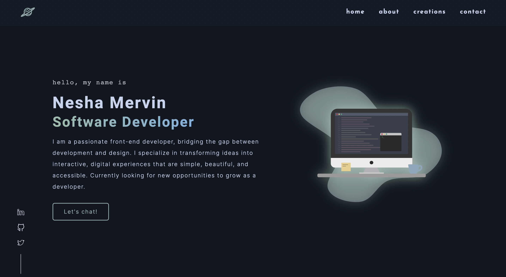

# neshacascia - v1

The first iteration of [neshacascia](https://neshacascia.com)

## Built with
- HTML5
- CSS Flexbox
- CSS Grid
- Vanilla JavaScript

## Lessons Learned
This was my very first project that I built from scratch. I first designed it in Figma, got to practice using CSS Flexbox and Grid for positioning and layouts. Ran into a lot of trial and error, especially with it being my first project but it gave me great experience and confidence working with CSS for my future projects.

## Future Updates
- Set up toggle button to switch colour theme between light and dark
- Rebuild portfolio using React

